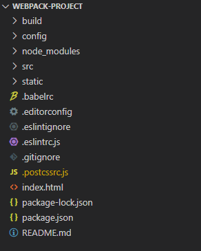
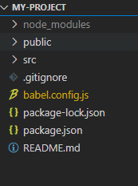

## vue init webpack xx与vue create xx的区别

#### 0. vue-cli2.x升级到vue-cli3.x

...


#### 1.vue init webpack app——vue-cli2.x初始化方式

使用`vue init webpack xx`创建项目目录如下



目录说明:

*`build`：及`config：webpack`配置相关（3.0转到`vue.config.js`中）

`node_modules`：通过`npm install`安装的依赖代码库

`src`：项目源码

*`static`：存放静态资源（3.0转到`src/assets`中）

*`.babelrc`：`babel`相关配置（因为我们的代码大多都是    `ES6`，而大多浏览器是不支持`ES6`的，所以我们需要`babel`帮我们转换成`ES5`语法）（3.0转到`babel.config.js`）

*`.editorconfig`：编辑器的配置，可以在这里修改编码、缩进等（在vscode中安装editorConfig for vs Code插件，.editorconfig才会起作用3.0中也可以添加）

*`.eslintignore`：设置忽略语法检查的目录文件 （）

*`.eslintrc.js`：`eslint`的配置文件（3.0中`ESLint `可以通过 `.eslintrc` 或 `package.json` 中的 `eslintConfig` 字段来配置）

`.gitignore`：`git`忽略里面设定的这些文件的提交 

*`.postcssrc.js`：工程化样式代码，主要内部配置文件如下（3.0需要手动创建，还需要再vue.config.js中添加对应的loader）

`index.html`：入口`html`文件 

`package.json`：项目的配置文件，用于描述一个项目，包括我们`init`时的设置、开发环境、生成环境的依赖插件及版本等。 

`package-lock.json`：普通`package.json`文件`“^2.0”`这样写的，意味着版本可以大于等于`2.0`，如此就会出现各种错误。

```js
// .postcssrc.js文件配置

module.exports = {
  "plugins": {
    "postcss-import": {},      //用于@import导入css文件
    "postcss-url": {},           //路径引入css文件或node_modules文件
    "postcss-aspect-ratio-mini": {},   //用来处理元素容器宽高比
    "postcss-write-svg": { utf8: false },    //用来处理移动端1px的解决方案。该插件主要使用的是border-image和background来做1px的相关处理。
    "postcss-cssnext": {},  //该插件可以让我们使用CSS未来的特性，其会对这些特性做相关的兼容性处理。
    "postcss-px-to-viewport": {    //把px单位转换为vw、vh、vmin或者vmax这样的视窗单位，也是vw适配方案的核心插件之一。
    	viewportWidth: 750,    //视窗的宽度
    	viewportHeight: 1334,   //视窗的高度
    	unitPrecision: 3,    //将px转化为视窗单位值的小数位数
    	viewportUnit: 'vw',    //指定要转换成的视窗单位值
    	selectorBlackList: ['.ignore', '.hairlines'],    //指定不转换视窗单位值得类，可以自定义，可以无限添加
    	minPixelValue: 1,    //小于等于1px不转换为视窗单位
    	mediaQuery: false   //允许在媒体查询中使用px
    },
    "postcss-viewport-units":{}, //给vw、vh、vmin和vmax做适配的操作,这是实现vw布局必不可少的一个插件
    "cssnano": {    //主要用来压缩和清理CSS代码。在Webpack中，cssnano和css-loader捆绑在一起，所以不需要自己加载它。
    	preset: "advanced",   //重复调用
    	autoprefixer: false,    //cssnext和cssnano都具有autoprefixer,事实上只需要一个，所以把默认的autoprefixer删除掉，然后把cssnano中的autoprefixer设置为false。
    	"postcss-zindex": false   //只要启用了这个插件，z-index的值就会重置为1
 		}
}
```

#### 2. vue create app——vue-cli3.x初始化方式

使用vue create xx创建项目产生目录如下



目录说明：

`node_modules`:通过`npm install`安装的依赖代码库 

`public`:部署到生产环境的目录 

`src`:源码 

`.gitignore`：`git`忽略里面设定的这些文件的提交 

`babel.config.js`:`babel`转码配置 

`package.json`：项目的配置文件，用于描述一个项目，包括我们init时的设置、开发环境、生成环境的依赖插件及版本等。 

`package-lock.json`：普通`package.json`文件`“^2.0”`这样写的，意味着版本可以大于等于`2.0`，如此就会出现各种错误。


在vue-cli3.x中没有`.postcssrc.js`，需要在package.json中配置

```js
// package.json

"postcss": {
    "plugins": {
      "autoprefixer": {},
      "postcss-px2rem-exclude":{
          "remUnit": 75,
          "exclude":"/node_modules|floder_name/i"
      }
    }
 }
```

