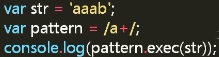
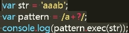
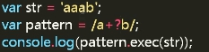
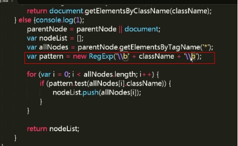
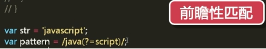
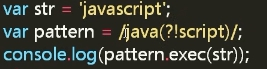
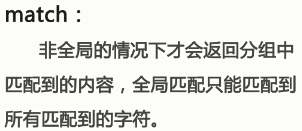
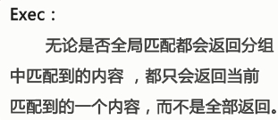
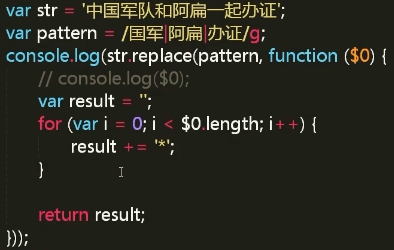

## 正则表达式中的特别注意点

|                           注意项                           | 内容                                                         |
| :--------------------------------------------------------: | ------------------------------------------------------------ |
|                          `/ab+/`                           | `+`只影响最近的一个字符                                      |
|                  `/(ab)+/`加括号分组匹配                   | 分组之后影响的就是`ab`两个字符了                             |
|                 `/(ab)c/`去匹配`str='abc'`                 | 匹配会返归`['abc', 'ab']`分组除了匹配外还会将括号里面的单独捕获出来 |
|        在分组前面加`?:`表示不需要单独捕获括号里面的        | 例如返回`['abc']` |
|                        `/(ab)cd\1/`                        | 转义符加数字代表转译符的分组\1代表第一个分组\2代表第二个分组，可以在//中间用来代替第一次或第n次的分组 |
|                        `RegExp.$1 `                        | `var r= /^(\d{4})-(\d{1,2})-(\d{1,2})$/; `//正则表达式 匹配出生日期(简单匹配)   `r.exec('1985-10-15');s1=RegExp.$1;s2=RegExp.$2;s3=RegExp.$3;alert(s1+" "+s2+" "+s3)`//结果为`1985 10 15` |
|                           `/\./`                           | 匹配一个小数点                                               |
|                   `/[^\n]/` 与` /./`相等                   | 不转义的小数点 匹配除换行符的所有字符                        |
|                  正则表达式默认“贪婪匹配”                  | 例如会匹配出3个`a` |
| 正则表达式将“贪婪匹配”变成非贪婪匹配只需要在后面加一个`？` | 例如会匹配出1个`a`但是会匹配出`aaab`因为在跳进允许下尽可能少的匹配，但是会从第一个可以匹配的开始匹配 |
|             构造函数里面的转译字符需要双重转译             | 例如        |
|      前瞻性匹配如果`java`后面是`script`就匹配出`java`      | 例如        |
|          如果`java`后面不是`script`就匹配出`java`          | 例如        |
|                  正则表达式中的`g、i、m`                   | `g`表示全局匹配、`i`表示忽略大小写、`m`表示多行匹配，多行匹配一定要和全局匹配和`$`首匹配`^`尾匹配结合起来用 |
|   `match`是`string`下面的方法`Exec`是`RegExp`下面的方法    |  |
|                `$0`表示 非分组匹配到的内容                 |           |