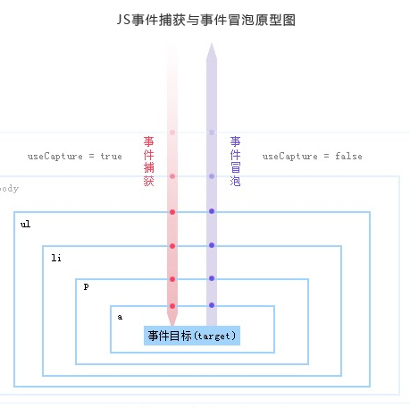

## js事件中捕获、冒泡以及事件中this与event的区别

#### 一 事件中捕获与冒泡的区别

从点击的点（点击位置）传递，冒泡是向上传递，捕获是向下传递（向上、向下指的是div的嵌套层级），传递过程中，到达的元素如果绑定了事件就会被触发。

#### 二 事件中this与event的区别

如例子:

```html
<!DOCTYPE html>
<html lang="en">
<head>
  <meta charset="UTF-8">
  <meta name="viewport" content="width=device-width, initial-scale=1.0">
  <title>test</title>
  <style>
    .parentBox {
        height: 100px;
        width: 100px;
        background: red;
    }
    .oneBox {
        height: 60px;
        width: 80px;
        background: blue;
    }
    .childBox {
        height: 30px;
        width: 60px;
        background: yellow;
    }
  </style>
</head>
<body>
    <div class="parentBox" id="pb">
        <div class="oneBox" id="ob">
            <div class="childBox" id="cb"></div>
        </div>
    </div>
	<script>
    function getEle(id) {
        return document.getElementById(id);
    }
    getEle('pb').addEventListener('click', function(e) {
        console.log(this, e, 'this is parentBox')
    })
    getEle('ob').addEventListener('click', function(e) {
        console.log(this, e, 'this is oneBox')
    })
    getEle('cb').addEventListener('click', function(e) {
        console.log(this, e, 'this is childBox')
    }, true)
	</script>
</body>
</html>

```

注意：

1. this指的是事件绑定的`dom`节点。`event`指的是点击节点的相关信息，其中`event.target`为点击的`dom`节点；
2. `addEventListener`有三个参数，除了上面用到的两个，**第三个参数是`Boolean`类型，默认`false`，不捕获但冒泡，设为`true`即可捕获**；

3. 当多个`div`嵌套，会按照捕获冒泡的规则传递事件，*最终确定事件传递的单项路径（向上或者向下后再向上）后开始按顺序触发事件*，但是只会触发**包含点击点**的`标签`绑定的事件。捕获类型事件在事件流向下（内层）传递中触发，冒泡类型事件在事件流向上（外层）传递中触发；
4. 原理图：



如果在li处点击了，`ul`出设为捕获（第三个参数为`true`）最终就会从ul向下传递到`a`，再向上传递，但是点击点在`li`处，所以`ul`绑定的事件会首先被触发，其次是`li`绑定的事件然后再触发`ul`上层的事件；

5. `IE`（`ie7/ie8`及以下）不支持事件捕获，也不支持`addEventLisener()`,`removeEventListener()`，实现了类似的两个方法`attachEvent()`,`detachEvent()`；

6. `event. preventDefault()`//阻止元素默认的行为，如链接的跳转、表单的提交，`event. stopPropagation()`//阻止事件冒泡;

7. `event`的其他常用属性

   `target`：发生事件的节点

   `currentTarget`：当前正在处理的事件的节点，在事件捕获或冒泡阶段

   `timeStamp`：事件发生的时间，时间戳

   `bubbles`：事件是否冒泡

   `cancelable`：事件是否可以用`preventDefault()`方法来取消默认的动作

   `keyCode`：按下的键的值；